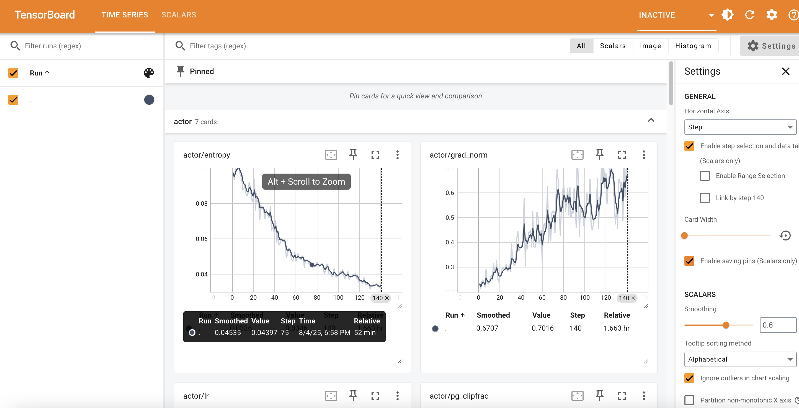

# Char Count
## Introduction
Char count is a simple NLP task. We create it for beginners to grasp the idea of RLVR. The task can be trained using a tiny model (e.g., https://huggingface.co/HuggingFaceTB/SmolLM2-135M) on a consumer GPU with only 8GB.

## Problem formulation
The prompt is: "How many {char} are there in {word}?". In order for LLM to better answer this question, we create SFT dataset with intermediate steps. For example,

```text
Question: How many n are there in n-i-n-e?
Answer:
n = n
i != n
n = n
e != n
\boxed{2}
```

Note that
- We add a dash between each individual char to make the task easier because each individual char will be tokenized to the same token by most tokenizer.
- In the SFT dataset, we create a CoT by listing all the individual chars and whether it equals to the target. In the end, it outputs the final answer inside the box.
- The task can be verified.
- The word is not always meaningful. Each char is sampled uniformly from a to z. We make the total length and the answer uniformly distributed within a range.

## Scripts
To create the dataset, run
```bash
python3 create_dataset.py
保存数据到当前目录下char_count
输出:
📄 SFT 训练集样本（前 3 条）：
[样本 1]
Prompt: How many t are there in word t-t-r-t-w-g-k-p-t-k-g-l-g?
Response:
 t = t.
t = t.
r != t.
t = t.
w != t.
g != t.
k != t.
p != t.
t = t.
k != t.
g != t.
l != t.
g != t.
\boxed{4} t in t-t-r-t-w-g-k-p-t-k-g-l-g.
--------------------------------------------------
[样本 2]
Prompt: How many q are there in word q-q-q-q-q-q-q-q-l-q-q-q-z-q-q?
Response:
 q = q.
q = q.
q = q.
q = q.
q = q.
q = q.
q = q.
q = q.
l != q.
q = q.
q = q.
q = q.
z != q.
q = q.
q = q.
\boxed{13} q in q-q-q-q-q-q-q-q-l-q-q-q-z-q-q.
--------------------------------------------------
[样本 3]
Prompt: How many s are there in word k-m-h-t-b-s-v-g-x-z-s-g-h-n-t-e-d-k-y?
Response:
 k != s.
m != s.
h != s.
t != s.
b != s.
s = s.
v != s.
g != s.
x != s.
z != s.
s = s.
g != s.
h != s.
n != s.
t != s.
e != s.
d != s.
k != s.
y != s.
\boxed{2} s in k-m-h-t-b-s-v-g-x-z-s-g-h-n-t-e-d-k-y.
--------------------------------------------------

📄 SFT 测试集样本（前 3 条）：
[样本 1]
Prompt: How many g are there in word b-p-d-n-y-z-g-t-n-i-t-q-n-e-c-f?
Response:
 b != g.
p != g.
d != g.
n != g.
y != g.
z != g.
g = g.
t != g.
n != g.
i != g.
t != g.
q != g.
n != g.
e != g.
c != g.
f != g.
\boxed{1} g in b-p-d-n-y-z-g-t-n-i-t-q-n-e-c-f.
--------------------------------------------------
[样本 2]
Prompt: How many v are there in word v-v-v-x-f-v-v-v-v-z-v?
Response:
 v = v.
v = v.
v = v.
x != v.
f != v.
v = v.
v = v.
v = v.
v = v.
z != v.
v = v.
\boxed{8} v in v-v-v-x-f-v-v-v-v-z-v.
--------------------------------------------------
[样本 3]
Prompt: How many p are there in word p-n-a-p-x-r-c-t-p-a-t-p-d-x-p-r-y-p-y?
Response:
 p = p.
n != p.
a != p.
p = p.
x != p.
r != p.
c != p.
t != p.
p = p.
a != p.
t != p.
p = p.
d != p.
x != p.
p = p.
r != p.
y != p.
p = p.
y != p.
\boxed{6} p in p-n-a-p-x-r-c-t-p-a-t-p-d-x-p-r-y-p-y.
--------------------------------------------------

📄 RL 训练集样本（前 3 条）：
[样本 1]
Prompt: [{'role': 'user', 'content': 'How many t are there in word t-t-r-t-w-g-k-p-t-k-g-l-g?'}]
Reward model: {'style': 'rule', 'ground_truth': '4'}
Extra info (response):
 t = t.
t = t.
r != t.
t = t.
w != t.
g != t.
k != t.
p != t.
t = t.
k != t.
g != t.
l != t.
g != t.
\boxed{4} t in t-t-r-t-w-g-k-p-t-k-g-l-g.
--------------------------------------------------
[样本 2]
Prompt: [{'role': 'user', 'content': 'How many q are there in word q-q-q-q-q-q-q-q-l-q-q-q-z-q-q?'}]
Reward model: {'style': 'rule', 'ground_truth': '13'}
Extra info (response):
 q = q.
q = q.
q = q.
q = q.
q = q.
q = q.
q = q.
q = q.
l != q.
q = q.
q = q.
q = q.
z != q.
q = q.
q = q.
\boxed{13} q in q-q-q-q-q-q-q-q-l-q-q-q-z-q-q.
--------------------------------------------------
[样本 3]
Prompt: [{'role': 'user', 'content': 'How many s are there in word k-m-h-t-b-s-v-g-x-z-s-g-h-n-t-e-d-k-y?'}]
Reward model: {'style': 'rule', 'ground_truth': '2'}
Extra info (response):
 k != s.
m != s.
h != s.
t != s.
b != s.
s = s.
v != s.
g != s.
x != s.
z != s.
s = s.
g != s.
h != s.
n != s.
t != s.
e != s.
d != s.
k != s.
y != s.
\boxed{2} s in k-m-h-t-b-s-v-g-x-z-s-g-h-n-t-e-d-k-y.
--------------------------------------------------

📄 RL 测试集样本（前 3 条）：
[样本 1]
Prompt: [{'role': 'user', 'content': 'How many g are there in word b-p-d-n-y-z-g-t-n-i-t-q-n-e-c-f?'}]
Reward model: {'style': 'rule', 'ground_truth': '1'}
Extra info (response):
 b != g.
p != g.
d != g.
n != g.
y != g.
z != g.
g = g.
t != g.
n != g.
i != g.
t != g.
q != g.
n != g.
e != g.
c != g.
f != g.
\boxed{1} g in b-p-d-n-y-z-g-t-n-i-t-q-n-e-c-f.
--------------------------------------------------
[样本 2]
Prompt: [{'role': 'user', 'content': 'How many v are there in word v-v-v-x-f-v-v-v-v-z-v?'}]
Reward model: {'style': 'rule', 'ground_truth': '8'}
Extra info (response):
 v = v.
v = v.
v = v.
x != v.
f != v.
v = v.
v = v.
v = v.
v = v.
z != v.
v = v.
\boxed{8} v in v-v-v-x-f-v-v-v-v-z-v.
--------------------------------------------------
[样本 3]
Prompt: [{'role': 'user', 'content': 'How many p are there in word p-n-a-p-x-r-c-t-p-a-t-p-d-x-p-r-y-p-y?'}]
Reward model: {'style': 'rule', 'ground_truth': '6'}
Extra info (response):
 p = p.
n != p.
a != p.
p = p.
x != p.
r != p.
c != p.
t != p.
p = p.
a != p.
t != p.
p = p.
d != p.
x != p.
p = p.
r != p.
y != p.
p = p.
y != p.
\boxed{6} p in p-n-a-p-x-r-c-t-p-a-t-p-d-x-p-r-y-p-y.
--------------------------------------------------

```
We create a train set and a val set. Both of them are used of SFT and RL. You can specify the total number of data, min/max length and data path.

SFT训练
```bash
export HF_ENDPOINT=https://hf-mirror.com
bash train_sft.sh
输出:
+ nproc_per_node=1
+ save_path=./models/sft
+ torchrun --standalone --nnodes=1 --nproc_per_node=1 -m verl.trainer.fsdp_sft_trainer data.train_files=/root/data/char_count/sft/train.parquet data.val_files=/root/data/char_count/sft/test.parquet data.prompt_key=prompt data.response_key=response data.micro_batch_size_per_gpu=8 data.max_length=256 data.train_batch_size=256 use_remove_padding=True model.partial_pretrain=HuggingFaceTB/SmolLM2-135M-Instruct trainer.default_local_dir=./models/sft trainer.project_name=char_count-sft trainer.experiment_name=char_count-sft-SmolLM2-135M-Instruct trainer.total_epochs=3 'trainer.logger=[console]' trainer.default_hdfs_dir=null
Normalize batch size by dp 1
Using sequence parallel size: 1
Using remove padding: True
Using FSDP rank 0 and size 1 for data distribution
Flash Attention 2.0 only supports torch.float16 and torch.bfloat16 dtypes, but the current dype in LlamaForCausalLM is torch.float32. You should run training or inference using Automatic Mixed-Precision via the `with torch.autocast(device_type='torch_device'):` decorator, or load the model with the `torch_dtype` argument. Example: `model = AutoModel.from_pretrained("openai/whisper-tiny", attn_implementation="flash_attention_2", torch_dtype=torch.float16)`
You are attempting to use Flash Attention 2.0 with a model not initialized on GPU. Make sure to move the model to GPU after initializing it on CPU with `model.to('cuda')`.
Monkey patch _flash_attention_forward in transformers.integrations.flash_attention
Skipping monkey patch for LlamaForCausalLM as use_fused_kernels is False or fused_kernels_backend is None
functools.partial(<function _or_policy at 0x70775620c700>, policies=[functools.partial(<function transformer_auto_wrap_policy at 0x70775620c5e0>, transformer_layer_cls={<class 'transformers.models.llama.modeling_llama.LlamaDecoderLayer'>})])
NCCL version 2.21.5+cuda12.4
Number of steps/epoch 35, number of epochs 3, total number of steps 105
{'data': {'train_batch_size': 256, 'micro_batch_size': None, 'micro_batch_size_per_gpu': 8, 'train_files': '/root/data/char_count/sft/train.parquet', 'val_files': '/root/data/char_count/sft/test.parquet', 'prompt_key': 'prompt', 'response_key': 'response', 'prompt_dict_keys': None, 'response_dict_keys': None, 'multiturn': {'enable': False, 'messages_key': 'messages', 'tools_key': 'tools', 'enable_thinking_key': 'enable_thinking'}, 'max_length': 256, 'truncation': 'error', 'balance_dp_token': False, 'chat_template': None, 'custom_cls': {'path': None, 'name': None}, 'use_shm': False}, 'model': {'partial_pretrain': 'HuggingFaceTB/SmolLM2-135M-Instruct', 'use_shm': False, 'fsdp_config': {'model_dtype': 'fp32', 'wrap_policy': {'min_num_params': 0}, 'cpu_offload': False, 'offload_params': False}, 'external_lib': None, 'enable_gradient_checkpointing': True, 'trust_remote_code': False, 'lora_rank': 0, 'lora_alpha': 16, 'target_modules': 'all-linear', 'use_liger': False, 'strategy': 'fsdp2'}, 'optim': {'lr': 1e-05, 'betas': [0.9, 0.95], 'weight_decay': 0.01, 'warmup_steps_ratio': 0.1, 'clip_grad': 1.0, 'lr_scheduler': 'cosine'}, 'ulysses_sequence_parallel_size': 1, 'use_remove_padding': True, 'trainer': {'default_local_dir': './models/sft', 'default_hdfs_dir': None, 'project_name': 'char_count-sft', 'experiment_name': 'char_count-sft-SmolLM2-135M-Instruct', 'total_epochs': 3, 'total_training_steps': None, 'logger': ['console'], 'seed': 1, 'save_freq': -1, 'test_freq': -1, 'nnodes': 1, 'n_gpus_per_node': 8, 'max_ckpt_to_keep': None, 'resume_mode': 'auto', 'resume_from_path': None, 'checkpoint': {'save_contents': ['model', 'optimizer', 'extra'], 'load_contents': '${trainer.checkpoint.save_contents}'}, 'device': 'cuda'}}
Epoch 1/3:   0%|                                                                                            | 0/35 [00:00<?, ?it/s]step:1 - train/loss:1.1166926622390747 - train/lr(1e-3):0.0010000000000000002
Epoch 1/3:   3%|██▍
...
Epoch 3/3:  83%|████████████████████████████████████████████████████████████████████▊              | 29/35 [06:26<01:19, 13.17s/it]step:100 - train/loss:0.0592457540333271 - train/lr(1e-3):6.81934829863884e-05
Epoch 3/3:  86%|███████████████████████████████████████████████████████████████████████▏           | 30/35 [06:39<01:06, 13.23s/it]step:101 - train/loss:0.057852603495121 - train/lr(1e-3):4.367965336512403e-05
Epoch 3/3:  89%|█████████████████████████████████████████████████████████████████████████▌         | 31/35 [06:53<00:52, 13.24s/it]step:102 - train/loss:0.06261121481657028 - train/lr(1e-3):2.4585487274942922e-05
Epoch 3/3:  91%|███████████████████████████████████████████████████████████████████████████▉       | 32/35 [07:06<00:39, 13.18s/it]step:103 - train/loss:0.061319638043642044 - train/lr(1e-3):1.0931863906127327e-05
Epoch 3/3:  94%|██████████████████████████████████████████████████████████████████████████████▎    | 33/35 [07:19<00:26, 13.15s/it]step:104 - train/loss:0.05746186152100563 - train/lr(1e-3):2.7337132953697555e-06
Epoch 3/3:  97%|████████████████████████████████████████████████████████████████████████████████▋  | 34/35 [07:32<00:13, 13.14s/it]step:105 - train/loss:0.06290543079376221 - train/lr(1e-3):0.0
step:105 - val/loss:0.058481086045503616
Saving checkpoint to: ./models/sft/global_step_105
[2025-08-04 12:26:42,932][/workspace/verl/verl/verl/utils/checkpoint/fsdp_checkpoint_manager.py][INFO] - [Rank 0] Saved model to /root/code/verl/recipe/char_count/models/sft/global_step_105/model_world_size_1_rank_0.pt
[2025-08-04 12:26:44,374][/workspace/verl/verl/verl/utils/checkpoint/fsdp_checkpoint_manager.py][INFO] - [Rank 0] Saved optim to /root/code/verl/recipe/char_count/models/sft/global_step_105/optim_world_size_1_rank_0.pt
[2025-08-04 12:26:44,376][/workspace/verl/verl/verl/utils/checkpoint/fsdp_checkpoint_manager.py][INFO] - [Rank 0] Saved extra_state to /root/code/verl/recipe/char_count/models/sft/global_step_105/extra_state_world_size_1_rank_0.pt
[2025-08-04 12:26:45,202][/workspace/verl/verl/verl/utils/checkpoint/fsdp_checkpoint_manager.py][INFO] - [Rank 0] Saved model config and tokenizer class to /root/code/verl/recipe/char_count/models/sft/global_step_105/huggingface
Saved dataloader state to: ./models/sft/global_step_105/data.pt
Updated checkpoint tracker: ./models/sft/latest_checkpointed_iteration.txt
Final validation metrics: {'val/loss': 0.058481086045503616}
Epoch 3/3:  97%|████████████████████████████████████████████████████████████████████████████████▋  | 34/35 [08:01<00:14, 14.17s/it]
```
We train SFT for 3 epochs. After 3 epochs, the validation score is around 0.12.

合并FSDP训练后的模型
```
cd models/sft/global_step_105/
cp -a huggingface/* .
python /workspace/verl/verl/scripts/legacy_model_merger.py merge \
    --backend fsdp \
    --local_dir models/sft/global_step_105 \
    --target_dir models/merged_hf_model
```
导出后的模型:
models/merged_hf_model

To run GRPO
```bash
bash train_grpo.sh
```
We train GRPO for 2 epochs. After 2 epochs, the validation score is around 0.36.

输出：
```
 bash train_grpo.sh
+ python3 -m verl.trainer.main_ppo algorithm.adv_estimator=grpo data.train_files=./char_count/rl/train.parquet data.val_files=./char_count/rl/test.parquet data.train_batch_size=128 data.max_prompt_length=128 data.max_response_length=128 data.filter_overlong_prompts=False data.truncation=error actor_rollout_ref.model.path=./models/merged_hf_model actor_rollout_ref.actor.optim.lr=1e-6 actor_rollout_ref.model.use_remove_padding=True actor_rollout_ref.actor.ppo_mini_batch_size=16 actor_rollout_ref.actor.use_dynamic_bsz=True actor_rollout_ref.actor.ppo_max_token_len_per_gpu=5000 actor_rollout_ref.actor.use_kl_loss=False actor_rollout_ref.actor.kl_loss_coef=0.0 actor_rollout_ref.actor.kl_loss_type=low_var_kl actor_rollout_ref.actor.entropy_coeff=0 actor_rollout_ref.model.enable_gradient_checkpointing=True actor_rollout_ref.actor.fsdp_config.param_offload=True actor_rollout_ref.actor.fsdp_config.optimizer_offload=True actor_rollout_ref.rollout.tensor_model_parallel_size=1 actor_rollout_ref.rollout.name=vllm actor_rollout_ref.rollout.gpu_memory_utilization=0.7 actor_rollout_ref.rollout.n=8 actor_rollout_ref.ref.fsdp_config.param_offload=True algorithm.use_kl_in_reward=False trainer.critic_warmup=0 'trainer.logger=["console"]' trainer.project_name=verl_example trainer.experiment_name=smol135m_grpo trainer.val_before_train=True trainer.n_gpus_per_node=1 trainer.nnodes=1 trainer.save_freq=-1 trainer.test_freq=5 trainer.total_epochs=2 custom_reward_function.path=./reward_function.py custom_reward_function.name=char_count_reward_function
2025-08-02 00:35:19,831 INFO worker.py:1879 -- Started a local Ray instance. View the dashboard at 127.0.0.1:8265
(TaskRunner pid=247607) TaskRunner hostname: yaqiyun-SYS-4028GR-TR2, PID: 247607
(TaskRunner pid=247607) {'actor_rollout_ref': {'actor': {'_target_': 'verl.workers.config.FSDPActorConfig',
(TaskRunner pid=247607)                                  'checkpoint': {'_target_': 'verl.trainer.config.CheckpointConfig',
(TaskRunner pid=247607)                                                 'async_save': False,
(TaskRunner pid=247607)                                                 'load_contents': ['model',
(TaskRunner pid=247607)                                                                   'optimizer',
(TaskRunner pid=247607)                                                                   'extra'],
(TaskRunner pid=247607)                                                 'save_contents': ['model',
(TaskRunner pid=247607)                                                                   'optimizer',
(TaskRunner pid=247607)                                                                   'extra']},
(TaskRunner pid=247607)                                  'clip_ratio': 0.2,
(TaskRunner pid=247607)                                  'clip_ratio_c': 3.0,
(TaskRunner pid=247607)                                  'clip_ratio_high': 0.2,
(TaskRunner pid=247607)                                  'clip_ratio_low': 0.2,
(TaskRunner pid=247607)                                  'entropy_checkpointing': False,
(TaskRunner pid=247607)                                  'entropy_coeff': 0,
(TaskRunner pid=247607)                                  'entropy_from_logits_with_chunking': False,
(TaskRunner pid=247607)                                  'fsdp_config': {'_target_': 'verl.workers.config.FSDPEngineConfig',
(TaskRunner pid=247607)                                                  'forward_prefetch': False,
(TaskRunner pid=247607)                                                  'fsdp_size': -1,
(TaskRunner pid=247607)                                                  'offload_policy': False,
(TaskRunner pid=247607)                                                  'optimizer_offload': True,
(TaskRunner pid=247607)                                                  'param_offload': True,
(TaskRunner pid=247607)                                                  'reshard_after_forward': True,
(TaskRunner pid=247607)                                                  'wrap_policy': {'min_num_params': 0}},
(TaskRunner pid=247607)                                  'grad_clip': 1.0,
(TaskRunner pid=247607)                                  'kl_loss_coef': 0.0,
(TaskRunner pid=247607)                                  'kl_loss_type': 'low_var_kl',
(TaskRunner pid=247607)                                  'loss_agg_mode': 'token-mean',
(TaskRunner pid=247607)                                  'optim': {'_target_': 'verl.workers.config.FSDPOptimizerConfig',
(TaskRunner pid=247607)                                            'lr': 1e-06,
(TaskRunner pid=247607)                                            'lr_warmup_steps': -1,
(TaskRunner pid=247607)                                            'lr_warmup_steps_ratio': 0.0,
(TaskRunner pid=247607)                                            'min_lr_ratio': 0.0,
(TaskRunner pid=247607)                                            'num_cycles': 0.5,
(TaskRunner pid=247607)                                            'total_training_steps': -1,
(TaskRunner pid=247607)                                            'warmup_style': 'constant',
(TaskRunner pid=247607)                                            'weight_decay': 0.01},
(TaskRunner pid=247607)                                  'policy_loss': {'_target_': 'verl.workers.config.PolicyLossConfig',
(TaskRunner pid=247607)                                                  'clip_cov_lb': 1.0,
(TaskRunner pid=247607)                                                  'clip_cov_ratio': 0.0002,
(TaskRunner pid=247607)                                                  'clip_cov_ub': 5.0,
(TaskRunner pid=247607)                                                  'kl_cov_ratio': 0.0002,
(TaskRunner pid=247607)                                                  'loss_mode': 'vanilla',
(TaskRunner pid=247607)                                                  'ppo_kl_coef': 0.1},
(TaskRunner pid=247607)                                  'ppo_epochs': 1,
(TaskRunner pid=247607)                                  'ppo_max_token_len_per_gpu': 5000,
(TaskRunner pid=247607)                                  'ppo_micro_batch_size': None,
(TaskRunner pid=247607)                                  'ppo_micro_batch_size_per_gpu': None,
(TaskRunner pid=247607)                                  'ppo_mini_batch_size': 16,
(TaskRunner pid=247607)                                  'shuffle': False,
(TaskRunner pid=247607)                                  'strategy': 'fsdp',
(TaskRunner pid=247607)                                  'ulysses_sequence_parallel_size': 1,
(TaskRunner pid=247607)                                  'use_dynamic_bsz': True,
(TaskRunner pid=247607)                                  'use_fused_kernels': False,
(TaskRunner pid=247607)                                  'use_kl_loss': False,
(TaskRunner pid=247607)                                  'use_remove_padding': True,
(TaskRunner pid=247607)                                  'use_torch_compile': True},
(TaskRunner pid=247607)                        'hybrid_engine': True,
(TaskRunner pid=247607)                        'model': {'custom_chat_template': None,
(TaskRunner pid=247607)                                  'enable_activation_offload': False,
(TaskRunner pid=247607)                                  'enable_gradient_checkpointing': True,
(TaskRunner pid=247607)                                  'exclude_modules': None,
(TaskRunner pid=247607)                                  'external_lib': None,
(TaskRunner pid=247607)                                  'fused_kernel_options': {'impl_backend': 'torch'},
(TaskRunner pid=247607)                                  'lora_alpha': 16,
(TaskRunner pid=247607)                                  'lora_rank': 0,
(TaskRunner pid=247607)                                  'override_config': {},
(TaskRunner pid=247607)                                  'path': './models/merged_hf_model',
(TaskRunner pid=247607)                                  'target_modules': 'all-linear',
(TaskRunner pid=247607)                                  'trust_remote_code': False,
(TaskRunner pid=247607)                                  'use_fused_kernels': False,
(TaskRunner pid=247607)                                  'use_liger': False,
(TaskRunner pid=247607)                                  'use_remove_padding': True,
(TaskRunner pid=247607)                                  'use_shm': False},
(TaskRunner pid=247607)                        'profiler': {'_target_': 'verl.utils.profiler.ProfilerConfig',
(TaskRunner pid=247607)                                     'all_ranks': False,
(TaskRunner pid=247607)                                     'discrete': False,
(TaskRunner pid=247607)                                     'ranks': []},
(TaskRunner pid=247607)                        'ref': {'entropy_checkpointing': False,
(TaskRunner pid=247607)                                'entropy_from_logits_with_chunking': False,
(TaskRunner pid=247607)                                'fsdp_config': {'_target_': 'verl.workers.config.FSDPEngineConfig',
(TaskRunner pid=247607)                                                'forward_prefetch': False,
(TaskRunner pid=247607)                                                'param_offload': True,
(TaskRunner pid=247607)                                                'reshard_after_forward': True,
(TaskRunner pid=247607)                                                'wrap_policy': {'min_num_params': 0}},
(TaskRunner pid=247607)                                'log_prob_max_token_len_per_gpu': 5000,
(TaskRunner pid=247607)                                'log_prob_micro_batch_size': None,
(TaskRunner pid=247607)                                'log_prob_micro_batch_size_per_gpu': None,
(TaskRunner pid=247607)                                'log_prob_use_dynamic_bsz': True,
(TaskRunner pid=247607)                                'strategy': 'fsdp',
(TaskRunner pid=247607)                                'ulysses_sequence_parallel_size': 1,
(TaskRunner pid=247607)                                'use_torch_compile': True},
(TaskRunner pid=247607)                        'rollout': {'agent': {'agent_loop_config_path': None,
(TaskRunner pid=247607)                                              'custom_async_server': {'name': None,
(TaskRunner pid=247607)                                                                      'path': None},
(TaskRunner pid=247607)                                              'num_workers': 8},
(TaskRunner pid=247607)                                    'calculate_log_probs': False,
(TaskRunner pid=247607)                                    'disable_log_stats': True,
(TaskRunner pid=247607)                                    'do_sample': True,
(TaskRunner pid=247607)                                    'dtype': 'bfloat16',
(TaskRunner pid=247607)                                    'enable_chunked_prefill': True,
(TaskRunner pid=247607)                                    'enforce_eager': True,
(TaskRunner pid=247607)                                    'engine_kwargs': {'sglang': {'attention_backend': None},
(TaskRunner pid=247607)                                                      'vllm': {'disable_mm_preprocessor_cache': False,
(TaskRunner pid=247607)                                                               'swap_space': None}},
(TaskRunner pid=247607)                                    'free_cache_engine': True,
(TaskRunner pid=247607)                                    'gpu_memory_utilization': 0.7,
(TaskRunner pid=247607)                                    'ignore_eos': False,
(TaskRunner pid=247607)                                    'layered_summon': False,
(TaskRunner pid=247607)                                    'load_format': 'dummy_dtensor',
(TaskRunner pid=247607)                                    'log_prob_max_token_len_per_gpu': 5000,
(TaskRunner pid=247607)                                    'log_prob_micro_batch_size': None,
(TaskRunner pid=247607)                                    'log_prob_micro_batch_size_per_gpu': None,
(TaskRunner pid=247607)                                    'log_prob_use_dynamic_bsz': True,
(TaskRunner pid=247607)                                    'max_model_len': None,
(TaskRunner pid=247607)                                    'max_num_batched_tokens': 8192,
(TaskRunner pid=247607)                                    'max_num_seqs': 1024,
(TaskRunner pid=247607)                                    'mode': 'sync',
(TaskRunner pid=247607)                                    'multi_stage_wake_up': False,
(TaskRunner pid=247607)                                    'multi_turn': {'enable': False,
(TaskRunner pid=247607)                                                   'format': 'hermes',
(TaskRunner pid=247607)                                                   'interaction_config_path': None,
(TaskRunner pid=247607)                                                   'max_assistant_turns': None,
(TaskRunner pid=247607)                                                   'max_parallel_calls': 1,
(TaskRunner pid=247607)                                                   'max_tool_response_length': 256,
(TaskRunner pid=247607)                                                   'max_user_turns': None,
(TaskRunner pid=247607)                                                   'tokenization_sanity_check_mode': 'strict',
(TaskRunner pid=247607)                                                   'tool_config_path': None,
(TaskRunner pid=247607)                                                   'tool_response_truncate_side': 'middle',
(TaskRunner pid=247607)                                                   'use_inference_chat_template': False},
(TaskRunner pid=247607)                                    'n': 8,
(TaskRunner pid=247607)                                    'name': 'vllm',
(TaskRunner pid=247607)                                    'prompt_length': 128,
(TaskRunner pid=247607)                                    'response_length': 128,
(TaskRunner pid=247607)                                    'temperature': 1.0,
(TaskRunner pid=247607)                                    'tensor_model_parallel_size': 1,
(TaskRunner pid=247607)                                    'top_k': -1,
(TaskRunner pid=247607)                                    'top_p': 1,
(TaskRunner pid=247607)                                    'trace': {'backend': None,
(TaskRunner pid=247607)                                              'token2text': False},
(TaskRunner pid=247607)                                    'update_weights_bucket_megabytes': 512,
(TaskRunner pid=247607)                                    'val_kwargs': {'do_sample': False,
(TaskRunner pid=247607)                                                   'n': 1,
(TaskRunner pid=247607)                                                   'temperature': 0,
(TaskRunner pid=247607)                                                   'top_k': -1,
(TaskRunner pid=247607)                                                   'top_p': 1.0}}},
(TaskRunner pid=247607)  'algorithm': {'_target_': 'verl.trainer.config.AlgoConfig',
(TaskRunner pid=247607)                'adv_estimator': 'grpo',
(TaskRunner pid=247607)                'gamma': 1.0,
(TaskRunner pid=247607)                'kl_ctrl': {'_target_': 'verl.trainer.config.KLControlConfig',
(TaskRunner pid=247607)                            'horizon': 10000,
(TaskRunner pid=247607)                            'kl_coef': 0.001,
(TaskRunner pid=247607)                            'target_kl': 0.1,
(TaskRunner pid=247607)                            'type': 'fixed'},
(TaskRunner pid=247607)                'kl_penalty': 'kl',
(TaskRunner pid=247607)                'lam': 1.0,
(TaskRunner pid=247607)                'norm_adv_by_std_in_grpo': True,
(TaskRunner pid=247607)                'pf_ppo': {'reweight_method': 'pow', 'weight_pow': 2.0},
(TaskRunner pid=247607)                'use_kl_in_reward': False,
(TaskRunner pid=247607)                'use_pf_ppo': False},
(TaskRunner pid=247607)  'critic': {'_target_': 'verl.workers.config.FSDPCriticConfig',
(TaskRunner pid=247607)             'checkpoint': {'_target_': 'verl.trainer.config.CheckpointConfig',
(TaskRunner pid=247607)                            'async_save': False,
(TaskRunner pid=247607)                            'load_contents': ['model', 'optimizer', 'extra'],
(TaskRunner pid=247607)                            'save_contents': ['model', 'optimizer', 'extra']},
(TaskRunner pid=247607)             'cliprange_value': 0.5,
(TaskRunner pid=247607)             'enable': None,
(TaskRunner pid=247607)             'forward_max_token_len_per_gpu': 32768,
(TaskRunner pid=247607)             'forward_micro_batch_size': None,
(TaskRunner pid=247607)             'forward_micro_batch_size_per_gpu': None,
(TaskRunner pid=247607)             'grad_clip': 1.0,
(TaskRunner pid=247607)             'loss_agg_mode': 'token-mean',
(TaskRunner pid=247607)             'model': {'_target_': 'verl.workers.config.FSDPCriticModelCfg',
(TaskRunner pid=247607)                       'enable_activation_offload': False,
(TaskRunner pid=247607)                       'enable_gradient_checkpointing': True,
(TaskRunner pid=247607)                       'external_lib': None,
(TaskRunner pid=247607)                       'fsdp_config': {'_target_': 'verl.workers.config.FSDPEngineConfig',
(TaskRunner pid=247607)                                       'forward_prefetch': False,
(TaskRunner pid=247607)                                       'fsdp_size': -1,
(TaskRunner pid=247607)                                       'offload_policy': False,
(TaskRunner pid=247607)                                       'optimizer_offload': False,
(TaskRunner pid=247607)                                       'param_offload': False,
(TaskRunner pid=247607)                                       'reshard_after_forward': True,
(TaskRunner pid=247607)                                       'wrap_policy': {'min_num_params': 0}},
(TaskRunner pid=247607)                       'lora_alpha': 16,
(TaskRunner pid=247607)                       'lora_rank': 0,
(TaskRunner pid=247607)                       'override_config': {},
(TaskRunner pid=247607)                       'path': '~/models/deepseek-llm-7b-chat',
(TaskRunner pid=247607)                       'target_modules': 'all-linear',
(TaskRunner pid=247607)                       'tokenizer_path': './models/merged_hf_model',
(TaskRunner pid=247607)                       'trust_remote_code': False,
(TaskRunner pid=247607)                       'use_remove_padding': False,
(TaskRunner pid=247607)                       'use_shm': False},
(TaskRunner pid=247607)             'optim': {'_target_': 'verl.workers.config.FSDPOptimizerConfig',
(TaskRunner pid=247607)                       'lr': 1e-05,
(TaskRunner pid=247607)                       'lr_warmup_steps': -1,
(TaskRunner pid=247607)                       'lr_warmup_steps_ratio': 0.0,
(TaskRunner pid=247607)                       'min_lr_ratio': None,
(TaskRunner pid=247607)                       'total_training_steps': -1,
(TaskRunner pid=247607)                       'warmup_style': 'constant',
(TaskRunner pid=247607)                       'weight_decay': 0.01},
(TaskRunner pid=247607)             'ppo_epochs': 1,
(TaskRunner pid=247607)             'ppo_max_token_len_per_gpu': 32768,
(TaskRunner pid=247607)             'ppo_micro_batch_size': None,
(TaskRunner pid=247607)             'ppo_micro_batch_size_per_gpu': None,
(TaskRunner pid=247607)             'ppo_mini_batch_size': 16,
(TaskRunner pid=247607)             'profiler': {'_target_': 'verl.utils.profiler.ProfilerConfig',
(TaskRunner pid=247607)                          'all_ranks': False,
(TaskRunner pid=247607)                          'discrete': False,
(TaskRunner pid=247607)                          'ranks': []},
(TaskRunner pid=247607)             'rollout_n': 8,
(TaskRunner pid=247607)             'shuffle': False,
(TaskRunner pid=247607)             'strategy': 'fsdp',
(TaskRunner pid=247607)             'ulysses_sequence_parallel_size': 1,
(TaskRunner pid=247607)             'use_dynamic_bsz': True},
(TaskRunner pid=247607)  'custom_reward_function': {'name': 'char_count_reward_function',
(TaskRunner pid=247607)                             'path': './reward_function.py'},
(TaskRunner pid=247607)  'data': {'custom_cls': {'name': None, 'path': None},
(TaskRunner pid=247607)           'datagen': {'name': None, 'path': None},
(TaskRunner pid=247607)           'dataloader_num_workers': 8,
(TaskRunner pid=247607)           'filter_overlong_prompts': False,
(TaskRunner pid=247607)           'filter_overlong_prompts_workers': 1,
(TaskRunner pid=247607)           'image_key': 'images',
(TaskRunner pid=247607)           'max_prompt_length': 128,
(TaskRunner pid=247607)           'max_response_length': 128,
(TaskRunner pid=247607)           'prompt_key': 'prompt',
(TaskRunner pid=247607)           'return_full_prompt': False,
(TaskRunner pid=247607)           'return_multi_modal_inputs': True,
(TaskRunner pid=247607)           'return_raw_chat': False,
(TaskRunner pid=247607)           'return_raw_input_ids': False,
(TaskRunner pid=247607)           'reward_fn_key': 'data_source',
(TaskRunner pid=247607)           'sampler': {'class_name': None, 'class_path': None},
(TaskRunner pid=247607)           'shuffle': True,
(TaskRunner pid=247607)           'tokenizer': None,
(TaskRunner pid=247607)           'train_batch_size': 128,
(TaskRunner pid=247607)           'train_files': './char_count/rl/train.parquet',
(TaskRunner pid=247607)           'truncation': 'error',
(TaskRunner pid=247607)           'trust_remote_code': False,
(TaskRunner pid=247607)           'use_shm': False,
(TaskRunner pid=247607)           'val_batch_size': None,
(TaskRunner pid=247607)           'val_files': './char_count/rl/test.parquet',
(TaskRunner pid=247607)           'validation_shuffle': False,
(TaskRunner pid=247607)           'video_key': 'videos'},
(TaskRunner pid=247607)  'ray_init': {'num_cpus': None, 'timeline_json_file': None},
(TaskRunner pid=247607)  'reward_model': {'enable': False,
(TaskRunner pid=247607)                   'forward_max_token_len_per_gpu': 32768,
(TaskRunner pid=247607)                   'launch_reward_fn_async': False,
(TaskRunner pid=247607)                   'max_length': None,
(TaskRunner pid=247607)                   'micro_batch_size': None,
(TaskRunner pid=247607)                   'micro_batch_size_per_gpu': None,
(TaskRunner pid=247607)                   'model': {'external_lib': None,
(TaskRunner pid=247607)                             'fsdp_config': {'_target_': 'verl.workers.config.FSDPEngineConfig',
(TaskRunner pid=247607)                                             'forward_prefetch': False,
(TaskRunner pid=247607)                                             'fsdp_size': -1,
(TaskRunner pid=247607)                                             'param_offload': False,
(TaskRunner pid=247607)                                             'reshard_after_forward': True,
(TaskRunner pid=247607)                                             'wrap_policy': {'min_num_params': 0}},
(TaskRunner pid=247607)                             'input_tokenizer': './models/merged_hf_model',
(TaskRunner pid=247607)                             'path': '~/models/FsfairX-LLaMA3-RM-v0.1',
(TaskRunner pid=247607)                             'trust_remote_code': False,
(TaskRunner pid=247607)                             'use_fused_kernels': False,
(TaskRunner pid=247607)                             'use_remove_padding': False,
(TaskRunner pid=247607)                             'use_shm': False},
(TaskRunner pid=247607)                   'profiler': {'_target_': 'verl.utils.profiler.ProfilerConfig',
(TaskRunner pid=247607)                                'all_ranks': False,
(TaskRunner pid=247607)                                'discrete': False,
(TaskRunner pid=247607)                                'ranks': []},
(TaskRunner pid=247607)                   'reward_manager': 'naive',
(TaskRunner pid=247607)                   'sandbox_fusion': {'max_concurrent': 64,
(TaskRunner pid=247607)                                      'memory_limit_mb': 1024,
(TaskRunner pid=247607)                                      'url': None},
(TaskRunner pid=247607)                   'strategy': 'fsdp',
(TaskRunner pid=247607)                   'ulysses_sequence_parallel_size': 1,
(TaskRunner pid=247607)                   'use_dynamic_bsz': True},
(TaskRunner pid=247607)  'trainer': {'balance_batch': True,
(TaskRunner pid=247607)              'controller_nsight_options': {'cuda-graph-trace': 'graph',
(TaskRunner pid=247607)                                            'cuda-memory-usage': 'true',
(TaskRunner pid=247607)                                            'trace': 'cuda,nvtx,cublas,ucx'},
(TaskRunner pid=247607)              'critic_warmup': 0,
(TaskRunner pid=247607)              'default_hdfs_dir': None,
(TaskRunner pid=247607)              'default_local_dir': 'checkpoints/verl_example/smol135m_grpo',
(TaskRunner pid=247607)              'del_local_ckpt_after_load': False,
(TaskRunner pid=247607)              'device': 'cuda',
(TaskRunner pid=247607)              'esi_redundant_time': 0,
(TaskRunner pid=247607)              'experiment_name': 'smol135m_grpo',
(TaskRunner pid=247607)              'log_val_generations': 0,
(TaskRunner pid=247607)              'logger': ['console'],
(TaskRunner pid=247607)              'max_actor_ckpt_to_keep': None,
(TaskRunner pid=247607)              'max_critic_ckpt_to_keep': None,
(TaskRunner pid=247607)              'n_gpus_per_node': 1,
(TaskRunner pid=247607)              'nnodes': 1,
(TaskRunner pid=247607)              'npu_profile': {'options': {'analysis': True,
(TaskRunner pid=247607)                                          'level': 'level1',
(TaskRunner pid=247607)                                          'record_shapes': False,
(TaskRunner pid=247607)                                          'roles': ['all'],
(TaskRunner pid=247607)                                          'save_path': './profiler_data',
(TaskRunner pid=247607)                                          'with_cpu': True,
(TaskRunner pid=247607)                                          'with_memory': False,
(TaskRunner pid=247607)                                          'with_module': False,
(TaskRunner pid=247607)                                          'with_npu': True,
(TaskRunner pid=247607)                                          'with_stack': False}},
(TaskRunner pid=247607)              'profile_continuous_steps': False,
(TaskRunner pid=247607)              'profile_steps': None,
(TaskRunner pid=247607)              'project_name': 'verl_example',
(TaskRunner pid=247607)              'ray_wait_register_center_timeout': 300,
(TaskRunner pid=247607)              'resume_from_path': None,
(TaskRunner pid=247607)              'resume_mode': 'auto',
(TaskRunner pid=247607)              'rollout_data_dir': None,
(TaskRunner pid=247607)              'save_freq': -1,
(TaskRunner pid=247607)              'test_freq': 5,
(TaskRunner pid=247607)              'total_epochs': 2,
(TaskRunner pid=247607)              'total_training_steps': None,
(TaskRunner pid=247607)              'use_legacy_worker_impl': 'auto',
(TaskRunner pid=247607)              'val_before_train': True,
(TaskRunner pid=247607)              'val_only': False,
(TaskRunner pid=247607)              'validation_data_dir': None,
(TaskRunner pid=247607)              'worker_nsight_options': {'capture-range': 'cudaProfilerApi',
(TaskRunner pid=247607)                                        'capture-range-end': None,
(TaskRunner pid=247607)                                        'cuda-graph-trace': 'graph',
(TaskRunner pid=247607)                                        'cuda-memory-usage': 'true',
(TaskRunner pid=247607)                                        'kill': 'none',
(TaskRunner pid=247607)                                        'trace': 'cuda,nvtx,cublas,ucx'}}}
(TaskRunner pid=247607) using customized reward function 'char_count_reward_function' from './reward_function.py'
(TaskRunner pid=247607) using customized reward function 'char_count_reward_function' from './reward_function.py'
(TaskRunner pid=247607) Using dataset class: RLHFDataset
(TaskRunner pid=247607) dataset len: 9000
(TaskRunner pid=247607) Using dataset class: RLHFDataset
(TaskRunner pid=247607) /workspace/verl/verl/verl/trainer/main_ppo.py:227: UserWarning: Disabled critic as algorithm.adv_estimator != gae. If it is not intended, please set critic.enable=True
(TaskRunner pid=247607)   trainer = RayPPOTrainer(
(TaskRunner pid=247607) dataset len: 1000
(TaskRunner pid=247607) minimal_bsz 1
(TaskRunner pid=247607) real_train_batch_size 1024
(TaskRunner pid=247607) DeprecationWarning: `ray.state.available_resources_per_node` is a private attribute and access will be removed in a future Ray version.
(TaskRunner pid=247607) [validate_config] All configuration checks passed successfully!
(TaskRunner pid=247607) Size of train dataloader: 70, Size of val dataloader: 1
(TaskRunner pid=247607) Total training steps: 140
(TaskRunner pid=247607) colocated worker base class <class 'verl.single_controller.base.worker.Worker'>
(TaskRunner pid=247607) WARNING:2025-08-02 00:35:34,451:Waiting for register center actor Se3S0W_register_center to be ready. Elapsed time: 0 seconds out of 300 seconds.
(WorkerDict pid=249887) Model config after override: LlamaConfig {
(WorkerDict pid=249887)   "architectures": [
(WorkerDict pid=249887)     "LlamaForCausalLM"
(WorkerDict pid=249887)   ],
(WorkerDict pid=249887)   "attention_bias": false,
(WorkerDict pid=249887)   "attention_dropout": 0.0,
(WorkerDict pid=249887)   "bos_token_id": 1,
(WorkerDict pid=249887)   "eos_token_id": 2,
(WorkerDict pid=249887)   "head_dim": 64,
(WorkerDict pid=249887)   "hidden_act": "silu",
(WorkerDict pid=249887)   "hidden_size": 576,
(WorkerDict pid=249887)   "initializer_range": 0.041666666666666664,
(WorkerDict pid=249887)   "intermediate_size": 1536,
(WorkerDict pid=249887)   "is_llama_config": true,
(WorkerDict pid=249887)   "max_position_embeddings": 8192,
(WorkerDict pid=249887)   "mlp_bias": false,
(WorkerDict pid=249887)   "model_type": "llama",
(WorkerDict pid=249887)   "num_attention_heads": 9,
(WorkerDict pid=249887)   "num_hidden_layers": 30,
(WorkerDict pid=249887)   "num_key_value_heads": 3,
(WorkerDict pid=249887)   "pad_token_id": 2,
(WorkerDict pid=249887)   "pretraining_tp": 1,
(WorkerDict pid=249887)   "rms_norm_eps": 1e-05,
(WorkerDict pid=249887)   "rope_interleaved": false,
(WorkerDict pid=249887)   "rope_scaling": null,
(WorkerDict pid=249887)   "rope_theta": 100000,
(WorkerDict pid=249887)   "tie_word_embeddings": true,
(WorkerDict pid=249887)   "torch_dtype": "bfloat16",
(WorkerDict pid=249887)   "transformers.js_config": {
(WorkerDict pid=249887)     "kv_cache_dtype": {
(WorkerDict pid=249887)       "fp16": "float16",
(WorkerDict pid=249887)       "q4f16": "float16"
(WorkerDict pid=249887)     }
(WorkerDict pid=249887)   },
(WorkerDict pid=249887)   "transformers_version": "4.51.1",
(WorkerDict pid=249887)   "use_cache": true,
(WorkerDict pid=249887)   "vocab_size": 49152
(WorkerDict pid=249887) }
(WorkerDict pid=249887)
(WorkerDict pid=249887) actor_module de local_path ./models/merged_hf_model
(WorkerDict pid=249887) Flash Attention 2.0 only supports torch.float16 and torch.bfloat16 dtypes, but the current dype in LlamaForCausalLM is torch.float32. You should run training or inference using Automatic Mixed-Precision via the `with torch.autocast(device_type='torch_device'):` decorator, or load the model with the `torch_dtype` argument. Example: `model = AutoModel.from_pretrained("openai/whisper-tiny", attn_implementation="flash_attention_2", torch_dtype=torch.float16)`
(WorkerDict pid=249887) You are attempting to use Flash Attention 2.0 with a model not initialized on GPU. Make sure to move the model to GPU after initializing it on CPU with `model.to('cuda')`.
(WorkerDict pid=249887) Monkey patch _flash_attention_forward in transformers.integrations.flash_attention
(WorkerDict pid=249887) Skipping monkey patch for LlamaForCausalLM as use_fused_kernels is False or fused_kernels_backend is torch
(WorkerDict pid=249887) LlamaForCausalLM contains 134.52M parameters
(WorkerDict pid=249887) wrap_policy: functools.partial(<function _or_policy at 0x725f52546f80>, policies=[functools.partial(<function transformer_auto_wrap_policy at 0x725f52546e60>, transformer_layer_cls={<class 'transformers.models.llama.modeling_llama.LlamaDecoderLayer'>})])
(WorkerDict pid=249887) /usr/local/lib/python3.10/dist-packages/torch/distributed/fsdp/_init_utils.py:444: UserWarning: FSDP is switching to use `NO_SHARD` instead of ShardingStrategy.FULL_SHARD since the world size is 1.
(WorkerDict pid=249887)   warnings.warn(
(WorkerDict pid=249887) NCCL version 2.21.5+cuda12.4
(WorkerDict pid=249887) Total steps: 140, num_warmup_steps: 0
(WorkerDict pid=249887) Actor use_remove_padding=True
(WorkerDict pid=249887) Actor use_fused_kernels=False
(WorkerDict pid=249887) WARNING 08-02 00:36:03 [cuda.py:93] To see benefits of async output processing, enable CUDA graph. Since, enforce-eager is enabled, async output processor cannot be used
(WorkerDict pid=249887) WARNING 08-02 00:36:03 [utils.py:2522] Methods determine_num_available_blocks,device_config,get_cache_block_size_bytes,initialize_cache not implemented in <vllm.v1.worker.gpu_worker.Worker object at 0x725e35329e70>
(TaskRunner pid=247607) Checkpoint tracker file does not exist: /workspace/verl/backend/char_count/checkpoints/verl_example/smol135m_grpo/latest_checkpointed_iteration.txt
(TaskRunner pid=247607) Training from scratch
(WorkerDict pid=249887) kwargs: {'n': 1, 'logprobs': 0, 'max_tokens': 128, 'detokenize': False, 'temperature': 1.0, 'top_k': -1, 'top_p': 1, 'ignore_eos': False}
(WorkerDict pid=249887) /usr/local/lib/python3.10/dist-packages/torch/distributed/fsdp/fully_sharded_data_parallel.py:690: FutureWarning: FSDP.state_dict_type() and FSDP.set_state_dict_type() are being deprecated. Please use APIs, get_state_dict() and set_state_dict(), which can support different parallelisms, FSDP1, FSDP2, DDP. API doc: https://pytorch.org/docs/stable/distributed.checkpoint.html#torch.distributed.checkpoint.state_dict.get_state_dict .Tutorial: https://pytorch.org/tutorials/recipes/distributed_checkpoint_recipe.html .
(WorkerDict pid=249887)   warnings.warn(
(TaskRunner pid=247607) test_gen_batch meta info: {'eos_token_id': 2, 'pad_token_id': 2, 'recompute_log_prob': False, 'do_sample': False, 'validate': True, 'global_steps': 0}
(WorkerDict pid=249887) /usr/local/lib/python3.10/dist-packages/torch/distributed/fsdp/_state_dict_utils.py:773: UserWarning: When using ``NO_SHARD`` for ``ShardingStrategy``, full_state_dict willbe returned.
(WorkerDict pid=249887)   warnings.warn(
(WorkerDict pid=249887) /usr/local/lib/python3.10/dist-packages/torch/distributed/fsdp/_state_dict_utils.py:711: UserWarning: When using ``NO_SHARD`` for ``ShardingStrategy``, full_state_dict willbe returned.
(WorkerDict pid=249887)   warnings.warn(
(TaskRunner pid=247607) validation generation end
(TaskRunner pid=247607) [prompt] system
(TaskRunner pid=247607) You are a helpful AI assistant named SmolLM, trained by Hugging Face
(TaskRunner pid=247607) user
(TaskRunner pid=247607) How many z are there in word o-u-z-z-z-z-z-z?
(TaskRunner pid=247607) assistant
(TaskRunner pid=247607)
(TaskRunner pid=247607) [response] o != z.
(TaskRunner pid=247607) u != z.
(TaskRunner pid=247607) z = z.
(TaskRunner pid=247607) z = z.
(TaskRunner pid=247607) z = z.
(TaskRunner pid=247607) z = z.
(TaskRunner pid=247607) z = z.
(TaskRunner pid=247607) z = z.
(TaskRunner pid=247607) z = z.
(TaskRunner pid=247607) z = z.
(TaskRunner pid=247607) \boxed{11} z in o-u-z-z-z-z-z-z.
(TaskRunner pid=247607) [ground_truth] 6
(TaskRunner pid=247607) [score] 0
(TaskRunner pid=247607) len reward_extra_infos_dict['reward']: 1000
Training Progress:   0%|          | 0/140 [00:00<?, ?it/s]
(TaskRunner pid=247607) ("Initial validation metrics: {'val-aux/char_count/reward/mean@1': "
(TaskRunner pid=247607)  "0.121524201853759, 'val-aux/char_count/reward/mean@2': 0.0, "
(TaskRunner pid=247607)  "'val-aux/char_count/reward/std@2': 0.0, "
(TaskRunner pid=247607)  "'val-aux/char_count/reward/best@2/mean': 0.0, "
(TaskRunner pid=247607)  "'val-aux/char_count/reward/best@2/std': 0.0, "
(TaskRunner pid=247607)  "'val-aux/char_count/reward/worst@2/mean': 0.0, "
(TaskRunner pid=247607)  "'val-aux/char_count/reward/worst@2/std': 0.0, "
(TaskRunner pid=247607)  "'val-core/char_count/reward/mean@3': 0.0, 'val-aux/char_count/reward/std@3': "
(TaskRunner pid=247607)  "0.0, 'val-core/char_count/reward/best@3/mean': 0.0, "
(TaskRunner pid=247607)  "'val-core/char_count/reward/best@3/std': 0.0, "
(TaskRunner pid=247607)  "'val-aux/char_count/reward/worst@3/mean': 0.0, "
(TaskRunner pid=247607)  "'val-aux/char_count/reward/worst@3/std': 0.0}")
(TaskRunner pid=247607) step:0 - val-aux/char_count/reward/mean@1:0.121524201853759 - val-aux/char_count/reward/mean@2:0.0 - val-aux/char_count/reward/std@2:0.0 - val-aux/char_count/reward/best@2/mean:0.0 - val-aux/char_count/reward/best@2/std:0.0 - val-aux/char_count/reward/worst@2/mean:0.0 - val-aux/char_count/reward/worst@2/std:0.0 - val-core/char_count/reward/mean@3:0.0 - val-aux/char_count/reward/std@3:0.0 - val-core/char_count/reward/best@3/mean:0.0 - val-core/char_count/reward/best@3/std:0.0 - val-aux/char_count/reward/worst@3/mean:0.0 - val-aux/char_count/reward/worst@3/std:0.0
Training Progress:   1%|          | 1/140 [00:49<1:53:43, 49.09s/it]
(TaskRunner pid=247607) step:1 - global_seqlen/min:159906 - global_seqlen/max:159906 - global_seqlen/minmax_diff:0 - global_seqlen/balanced_min:159906 - global_seqlen/balanced_max:159906 - global_seqlen/mean:159906.0 - actor/entropy:0.09767807275056839 - actor/pg_loss:-0.0036091046008680547 - actor/pg_clipfrac:0.0012726205209868827 - actor/ppo_kl:0.00015248422758824226 - actor/pg_clipfrac_lower:0.0 - actor/grad_norm:0.2057906948029995 - perf/mfu/actor:0.0 - perf/max_memory_allocated_gb:18.921902179718018 - perf/max_memory_reserved_gb:23.166015625 - perf/cpu_memory_used_gb:36.80875778198242 - actor/lr:1e-06 - training/global_step:1 - training/epoch:0 - critic/score/mean:0.0888671875 - critic/score/max:1.0 - critic/score/min:0.0 - critic/rewards/mean:0.0888671875 - critic/rewards/max:1.0 - critic/rewards/min:0.0 - critic/advantages/mean:0.003788670524954796 - critic/advantages/max:2.4748666286468506 - critic/advantages/min:-1.20761239528656 - critic/returns/mean:0.003788670524954796 - critic/returns/max:2.4748666286468506 - critic/returns/min:-1.20761239528656 - response_length/mean:93.126953125 - response_length/max:128.0 - response_length/min:5.0 - response_length/clip_ratio:0.19921875 - prompt_length/mean:63.03125 - prompt_length/max:77.0 - prompt_length/min:47.0 - prompt_length/clip_ratio:0.0 - timing_s/start_profile:0.0005959402769804001 - timing_s/generate_sequences:15.364402770996094 - timing_s/reshard:0.23392614722251892 - timing_s/gen:16.22749171219766 - timing_s/reward:0.42415859922766685 - timing_s/old_log_prob:10.275943230837584 - timing_s/adv:0.07341944053769112 - timing_s/update_actor:21.522068275138736 - timing_s/step:48.7025266494602 - timing_s/stop_profile:0.00015546195209026337 - timing_per_token_ms/adv:0.0004591412488442655 - timing_per_token_ms/gen:0.1701672753528414 - timing_per_token_ms/update_actor:0.1345919995193347 - perf/total_num_tokens:159906 - perf/time_per_step:48.7025266494602 - perf/throughput:3283.320414789452

```

# 查看训练的日志
tensorboard --logdir tensorboard_log/verl_example/smol135m_grpo/ --bind_all --port 13383
TensorFlow installation not found - running with reduced feature set.

NOTE: Using experimental fast data loading logic. To disable, pass
    "--load_fast=false" and report issues on GitHub. More details:
    https://github.com/tensorflow/tensorboard/issues/4784

TensorBoard 2.20.0 at http://xxxx:13383/ (Press CTRL+C to quit)




合并FSDP训练后的actor模型
```
cd checkpoint/smol135m_grpo/global_step_360/actor/
cp -a huggingface/* .
cd - 
python /workspace/verl/verl/scripts/legacy_model_merger.py merge \
    --backend fsdp \
    --local_dir checkpoint/smol135m_grpo/global_step_360/actor/ \
    --target_dir checkpoint/merged_hf_model
ls -alht checkpoint/merged_hf_model
total 316M
drwxr-xr-x 2 root root 4.0K Aug  5 00:46 .
-rw-r--r-- 1 root root 3.4M Aug  5 00:46 tokenizer.json
-rw-r--r-- 1 root root 456K Aug  5 00:46 merges.txt
-rw-r--r-- 1 root root 782K Aug  5 00:46 vocab.json
-rw-r--r-- 1 root root  655 Aug  5 00:46 special_tokens_map.json
-rw-r--r-- 1 root root 3.8K Aug  5 00:46 tokenizer_config.json
-rw-r--r-- 1 root root 311M Aug  5 00:46 model.safetensors
-rw-r--r-- 1 root root  879 Aug  5 00:46 config.json
-rw-r--r-- 1 root root  132 Aug  5 00:46 generation_config.json
drwxr-xr-x 4 root root 4.0K Aug  5 00:46 ..
```

# 推理训练后的模型
```
# 使用哪个模型
export CUDA_VISIBLE_DEVICES=1
export HF_ENDPOINT=https://hf-mirror.com
ls checkpoint/merged_hf_model
vllm serve checkpoint/merged_hf_model --host 0.0.0.0 --port 5306
输出：
INFO 08-05 09:08:22 [__init__.py:239] Automatically detected platform cuda.
INFO 08-05 09:08:28 [api_server.py:1043] vLLM API server version 0.8.5.post1
INFO 08-05 09:08:28 [api_server.py:1044] args: Namespace(subparser='serve', model_tag='checkpoint/merged_hf_model', config='', host='0.0.0.0', port=5306, uvicorn_log_level='info', disable_uvicorn_access_log=False, allow_credentials=False, allowed_origins=['*'], allowed_methods=['*'], allowed_headers=['*'], api_key=None, lora_modules=None, prompt_adapters=None, chat_template=None, chat_template_content_format='auto', response_role='assistant', ssl_keyfile=None, ssl_certfile=None, ssl_ca_certs=None, enable_ssl_refresh=False, ssl_cert_reqs=0, root_path=None, middleware=[], return_tokens_as_token_ids=False, disable_frontend_multiprocessing=False, enable_request_id_headers=False, enable_auto_tool_choice=False, tool_call_parser=None, tool_parser_plugin='', model='checkpoint/merged_hf_model', task='auto', tokenizer=None, hf_config_path=None, skip_tokenizer_init=False, revision=None, code_revision=None, tokenizer_revision=None, tokenizer_mode='auto', trust_remote_code=False, allowed_local_media_path=None, load_format='auto', download_dir=None, model_loader_extra_config={}, use_tqdm_on_load=True, config_format=<ConfigFormat.AUTO: 'auto'>, dtype='auto', max_model_len=None, guided_decoding_backend='auto', reasoning_parser=None, logits_processor_pattern=None, model_impl='auto', distributed_executor_backend=None, pipeline_parallel_size=1, tensor_parallel_size=1, data_parallel_size=1, enable_expert_parallel=False, max_parallel_loading_workers=None, ray_workers_use_nsight=False, disable_custom_all_reduce=False, block_size=None, gpu_memory_utilization=0.9, swap_space=4, kv_cache_dtype='auto', num_gpu_blocks_override=None, enable_prefix_caching=None, prefix_caching_hash_algo='builtin', cpu_offload_gb=0, calculate_kv_scales=False, disable_sliding_window=False, use_v2_block_manager=True, seed=None, max_logprobs=20, disable_log_stats=False, quantization=None, rope_scaling=None, rope_theta=None, hf_token=None, hf_overrides=None, enforce_eager=False, max_seq_len_to_capture=8192, tokenizer_pool_size=0, tokenizer_pool_type='ray', tokenizer_pool_extra_config={}, limit_mm_per_prompt={}, mm_processor_kwargs=None, disable_mm_preprocessor_cache=False, enable_lora=None, enable_lora_bias=False, max_loras=1, max_lora_rank=16, lora_extra_vocab_size=256, lora_dtype='auto', long_lora_scaling_factors=None, max_cpu_loras=None, fully_sharded_loras=False, enable_prompt_adapter=None, max_prompt_adapters=1, max_prompt_adapter_token=0, device='auto', speculative_config=None, ignore_patterns=[], served_model_name=None, qlora_adapter_name_or_path=None, show_hidden_metrics_for_version=None, otlp_traces_endpoint=None, collect_detailed_traces=None, disable_async_output_proc=False, max_num_batched_tokens=None, max_num_seqs=None, max_num_partial_prefills=1, max_long_partial_prefills=1, long_prefill_token_threshold=0, num_lookahead_slots=0, scheduler_delay_factor=0.0, preemption_mode=None, num_scheduler_steps=1, multi_step_stream_outputs=True, scheduling_policy='fcfs', enable_chunked_prefill=None, disable_chunked_mm_input=False, scheduler_cls='vllm.core.scheduler.Scheduler', override_neuron_config=None, override_pooler_config=None, compilation_config=None, kv_transfer_config=None, worker_cls='auto', worker_extension_cls='', generation_config='auto', override_generation_config=None, enable_sleep_mode=False, additional_config=None, enable_reasoning=False, disable_cascade_attn=False, disable_log_requests=False, max_log_len=None, disable_fastapi_docs=False, enable_prompt_tokens_details=False, enable_server_load_tracking=False, dispatch_function=<function ServeSubcommand.cmd at 0x7fdc5b08bf40>)
INFO 08-05 09:08:37 [config.py:717] This model supports multiple tasks: {'embed', 'generate', 'classify', 'reward', 'score'}. Defaulting to 'generate'.
INFO 08-05 09:08:37 [config.py:2003] Chunked prefill is enabled with max_num_batched_tokens=2048.
INFO 08-05 09:08:41 [__init__.py:239] Automatically detected platform cuda.
INFO 08-05 09:08:45 [core.py:58] Initializing a V1 LLM engine (v0.8.5.post1) with config: model='checkpoint/merged_hf_model', speculative_config=None, tokenizer='checkpoint/merged_hf_model', skip_tokenizer_init=False, tokenizer_mode=auto, revision=None, override_neuron_config=None, tokenizer_revision=None, trust_remote_code=False, dtype=torch.bfloat16, max_seq_len=8192, download_dir=None, load_format=auto, tensor_parallel_size=1, pipeline_parallel_size=1, disable_custom_all_reduce=False, quantization=None, enforce_eager=False, kv_cache_dtype=auto,  device_config=cuda, decoding_config=DecodingConfig(guided_decoding_backend='auto', reasoning_backend=None), observability_config=ObservabilityConfig(show_hidden_metrics=False, otlp_traces_endpoint=None, collect_model_forward_time=False, collect_model_execute_time=False), seed=None, served_model_name=checkpoint/merged_hf_model, num_scheduler_steps=1, multi_step_stream_outputs=True, enable_prefix_caching=True, chunked_prefill_enabled=True, use_async_output_proc=True, disable_mm_preprocessor_cache=False, mm_processor_kwargs=None, pooler_config=None, compilation_config={"level":3,"custom_ops":["none"],"splitting_ops":["vllm.unified_attention","vllm.unified_attention_with_output"],"use_inductor":true,"compile_sizes":[],"use_cudagraph":true,"cudagraph_num_of_warmups":1,"cudagraph_capture_sizes":[512,504,496,488,480,472,464,456,448,440,432,424,416,408,400,392,384,376,368,360,352,344,336,328,320,312,304,296,288,280,272,264,256,248,240,232,224,216,208,200,192,184,176,168,160,152,144,136,128,120,112,104,96,88,80,72,64,56,48,40,32,24,16,8,4,2,1],"max_capture_size":512}
WARNING 08-05 09:08:45 [utils.py:2522] Methods determine_num_available_blocks,device_config,get_cache_block_size_bytes,initialize_cache not implemented in <vllm.v1.worker.gpu_worker.Worker object at 0x70481d3f0670>
INFO 08-05 09:08:46 [parallel_state.py:1004] rank 0 in world size 1 is assigned as DP rank 0, PP rank 0, TP rank 0
INFO 08-05 09:08:46 [cuda.py:221] Using Flash Attention backend on V1 engine.
INFO 08-05 09:08:46 [topk_topp_sampler.py:59] Using FlashInfer for top-p & top-k sampling.
INFO 08-05 09:08:46 [gpu_model_runner.py:1329] Starting to load model checkpoint/merged_hf_model...
Loading safetensors checkpoint shards:   0% Completed | 0/1 [00:00<?, ?it/s]
Loading safetensors checkpoint shards: 100% Completed | 1/1 [00:00<00:00, 10.97it/s]

INFO 08-05 09:08:46 [loader.py:458] Loading weights took 0.10 seconds
INFO 08-05 09:08:46 [gpu_model_runner.py:1347] Model loading took 0.2540 GiB and 0.292183 seconds
INFO 08-05 09:08:56 [backends.py:420] Using cache directory: /home/wac/johnson/.cache/vllm/torch_compile_cache/f1630b6b52/rank_0_0 for vLLM's torch.compile
INFO 08-05 09:08:56 [backends.py:430] Dynamo bytecode transform time: 9.22 s
INFO 08-05 09:09:02 [backends.py:118] Directly load the compiled graph(s) for shape None from the cache, took 6.089 s
INFO 08-05 09:09:04 [monitor.py:33] torch.compile takes 9.22 s in total
INFO 08-05 09:09:04 [kv_cache_utils.py:634] GPU KV cache size: 946,384 tokens
INFO 08-05 09:09:04 [kv_cache_utils.py:637] Maximum concurrency for 8,192 tokens per request: 115.53x
INFO 08-05 09:09:26 [gpu_model_runner.py:1686] Graph capturing finished in 22 secs, took 0.45 GiB
INFO 08-05 09:09:26 [core.py:159] init engine (profile, create kv cache, warmup model) took 40.02 seconds
INFO 08-05 09:09:26 [core_client.py:439] Core engine process 0 ready.
INFO 08-05 09:09:26 [api_server.py:1090] Starting vLLM API server on http://0.0.0.0:5306
INFO 08-05 09:09:26 [launcher.py:28] Available routes are:
INFO 08-05 09:09:26 [launcher.py:36] Route: /openapi.json, Methods: HEAD, GET
INFO 08-05 09:09:26 [launcher.py:36] Route: /docs, Methods: HEAD, GET
INFO 08-05 09:09:26 [launcher.py:36] Route: /docs/oauth2-redirect, Methods: HEAD, GET
INFO 08-05 09:09:26 [launcher.py:36] Route: /redoc, Methods: HEAD, GET
INFO 08-05 09:09:26 [launcher.py:36] Route: /health, Methods: GET
INFO 08-05 09:09:26 [launcher.py:36] Route: /load, Methods: GET
INFO 08-05 09:09:26 [launcher.py:36] Route: /ping, Methods: POST, GET
INFO 08-05 09:09:26 [launcher.py:36] Route: /tokenize, Methods: POST
INFO 08-05 09:09:26 [launcher.py:36] Route: /detokenize, Methods: POST
INFO 08-05 09:09:26 [launcher.py:36] Route: /v1/models, Methods: GET
INFO 08-05 09:09:26 [launcher.py:36] Route: /version, Methods: GET
INFO 08-05 09:09:26 [launcher.py:36] Route: /v1/chat/completions, Methods: POST
INFO 08-05 09:09:26 [launcher.py:36] Route: /v1/completions, Methods: POST
INFO 08-05 09:09:26 [launcher.py:36] Route: /v1/embeddings, Methods: POST
INFO 08-05 09:09:26 [launcher.py:36] Route: /pooling, Methods: POST
INFO 08-05 09:09:26 [launcher.py:36] Route: /score, Methods: POST
INFO 08-05 09:09:26 [launcher.py:36] Route: /v1/score, Methods: POST
INFO 08-05 09:09:26 [launcher.py:36] Route: /v1/audio/transcriptions, Methods: POST
INFO 08-05 09:09:26 [launcher.py:36] Route: /rerank, Methods: POST
INFO 08-05 09:09:26 [launcher.py:36] Route: /v1/rerank, Methods: POST
INFO 08-05 09:09:26 [launcher.py:36] Route: /v2/rerank, Methods: POST
INFO 08-05 09:09:26 [launcher.py:36] Route: /invocations, Methods: POST
INFO 08-05 09:09:26 [launcher.py:36] Route: /metrics, Methods: GET
INFO:     Started server process [1387984]
INFO:     Waiting for application startup.
INFO:     Application startup complete

测试是否获取模型成功
# curl http://localhost:5306/v1/models
{"object":"list","data":[{"id":"checkpoint/merged_hf_model","object":"model","created":1754356232,"owned_by":"vllm","root":"checkpoint/merged_hf_model","parent":null,"max_model_len":8192,"permission":[{"id":"modelperm-7623dc28727446089ab74b040f63c579","object":"model_permission","created":1754356232,"allow_create_engine":false,"allow_sampling":true,"allow_logprobs":true,"allow_search_indices":false,"allow_view":true,"allow_fine_tuning":false,"organization":"*","group":null,"is_blocking":false}]}]}
# 测试一条数据
curl http://localhost:5306/v1/chat/completions \
    -H "Content-Type: application/json" \
    -d '{
        "model": "checkpoint/merged_hf_model",
        "messages": [
            {"role": "system", "content": "You are a helpful assistant."},
            {"role": "user", "content": "How many n are there in n-i-n-e?"}
        ]
    }'

```